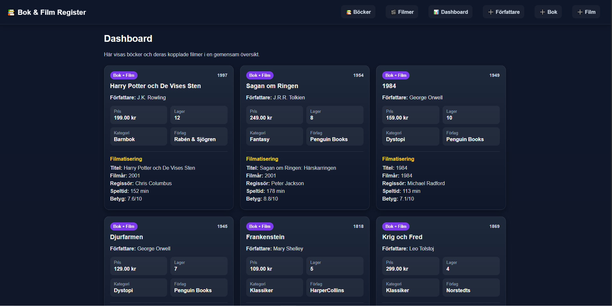
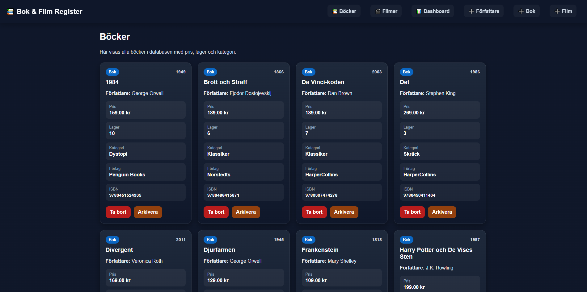
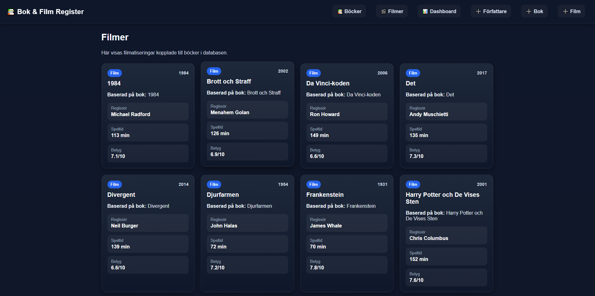
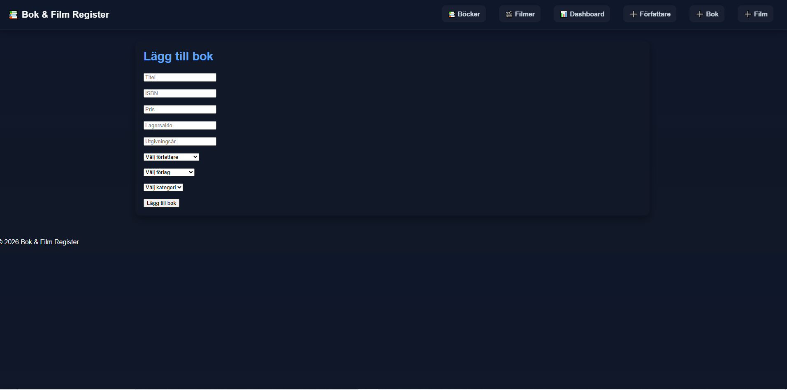
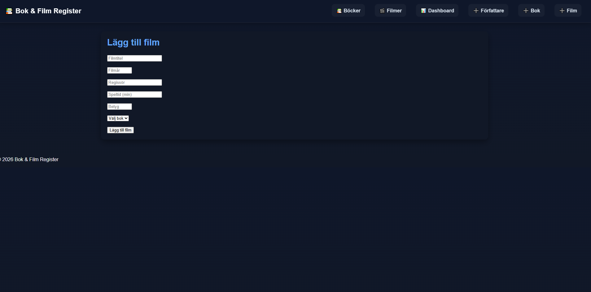
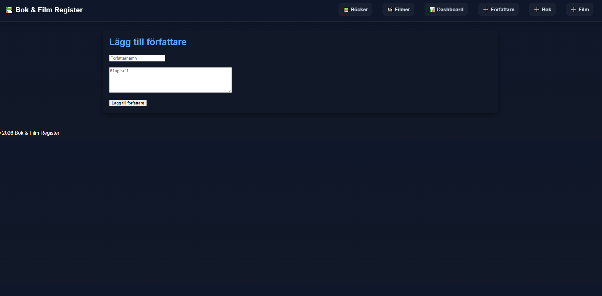

# 📚 Bok & Film Register

Ett MVC-baserat projekt utvecklat inom kursen **Databaskonstruktion**.
Systemet hanterar böcker, filmer och författare med fokus på databaskopplingar och SQL-funktionalitet.

## 🔧 Funktioner

* Lägg till författare
* Lägg till böcker (kopplade till författare, förlag och kategori)
* Lägg till filmer (kopplade till böcker)
* Visa böcker och filmer
* Dashboard med kombinerad bok- och filminformation

## 🧠 Databasfokus

Projektet innehåller flera avancerade databaskoncept:

* **Relationer (Foreign Keys)** mellan tabeller
* **Stored Procedures** (t.ex. `LaggTillBok`, `LaggTillFilm`, `FlyttaTillArkiv`)
* **Views** (t.ex. `Vy_BokInfo`, `Vy_BokFilmInfo`)
* **Triggers** för loggning av förändringar
* **Constraints** (UNIQUE, CHECK)

## 🛠 Tekniker

* PHP (MVC-struktur)
* MySQL
* HTML / CSS

## 📁 Struktur

* Controllers
* Models
* Views
* Config

## 🎓 Kontext

Projektet är utvecklat som en del av studier vid **Högskolan i Skövde** inom kursen *Databaskonstruktion*.

## 🚀 Syfte

Syftet med projektet är att visa förståelse för:

* Databasdesign
* Normalisering
* SQL (procedurer, vyer, triggers)
* Koppling mellan backend (PHP) och databas

### ### Dashboard (Bok & Film)

### Böcker

### Filmer

### Lägg till bok

### Lägg till film

### Lägg till författare

---
