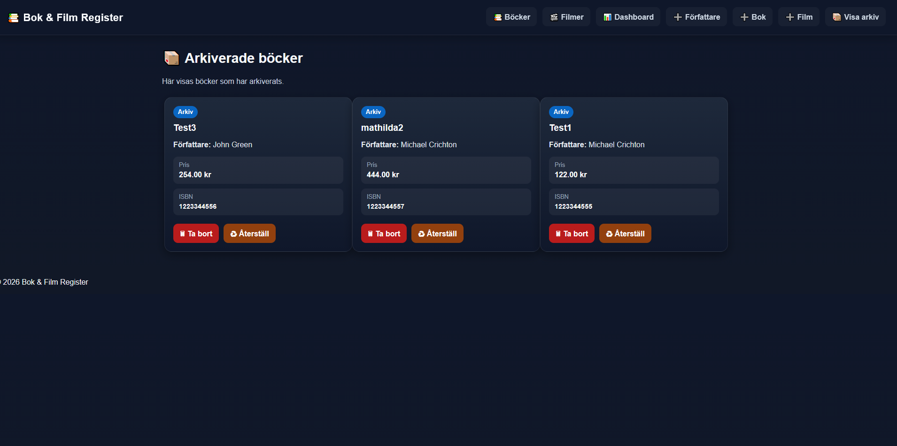

# 📚 Bok & Film Register (MVC)

Ett fullstack-projekt byggt med **PHP (MVC)** och **MySQL** där fokus ligger på databaskonstruktion, relationer och avancerad SQL.

Projektet demonstrerar hur en databas integreras med en webbapplikation i en tydlig MVC-struktur.

---

## 🚀 Funktioner

* 📚 Hantera böcker (CRUD)
* 👤 Koppla böcker till författare, förlag och kategorier
* 🎬 Hantera filmer kopplade till böcker
* 📦 Arkivera och återställ böcker (Stored Procedures)
* 📊 Dashboard med kombinerad bok- och filminformation
* 🗑 Loggning via triggers vid ändringar i databasen

---

## 🧠 Databas & SQL

Projektet innehåller flera viktiga databaskoncept:

* **Relationer (Foreign Keys)** mellan tabeller
* **Stored Procedures**

  * `LaggTillBok`
  * `LaggTillFilm`
  * `FlyttaTillArkiv`
  * `AterstallBok`
* **Views**

  * `Vy_BokInfo`
  * `Vy_BokFilmInfo`
* **Triggers**

  * Loggar när böcker läggs till eller tas bort
* **Constraints**

  * `UNIQUE`, `CHECK`, `NOT NULL`

---

## 🛠 Tekniker

* PHP (MVC-struktur)
* MySQL
* PDO (databaskoppling)
* HTML / CSS

---

## 📁 Projektstruktur

```
Config/
Controllers/
Models/
Views/
Public/
assets/
```

---

## 🎓 Kontext

Projektet är utvecklat vid **Högskolan i Skövde** inom kursen *Databaskonstruktion*.

---

## 🎯 Syfte

Projektet visar praktisk förståelse för:

* Databasdesign
* Normalisering
* SQL (procedurer, vyer, triggers)
* Backend-utveckling i PHP
* MVC-arkitektur

---

## ⚙️ Installation

1. Klona projektet:

```
git clone https://github.com/a24wilka/bok-film-register-mvc.git
```

2. Importera databasen i MySQL (via phpMyAdmin eller Workbench)

3. Skapa config-fil:

```
cp Config/config.example.php Config/config.php
```

4. Fyll i dina databasuppgifter i:

```
Config/config.php
```

5. Starta XAMPP och öppna:

```
http://localhost/Bokhandel_mvc/Public/
```

---

## 📸 Screenshots

### 📊 Dashboard (Bok & Film)


### 📚 Böcker


### 🎬 Filmer


### ➕ Lägg till bok


### ➕ Lägg till film


### ➕ Lägg till författare


### 📦 Arkivering & Återställning



---
## 👨‍💻 Författare

**Willis Kabuye**
GitHub: https://github.com/a24wilka